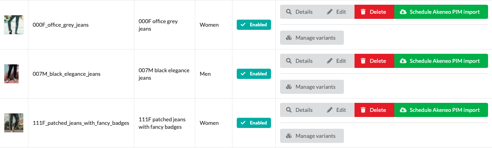
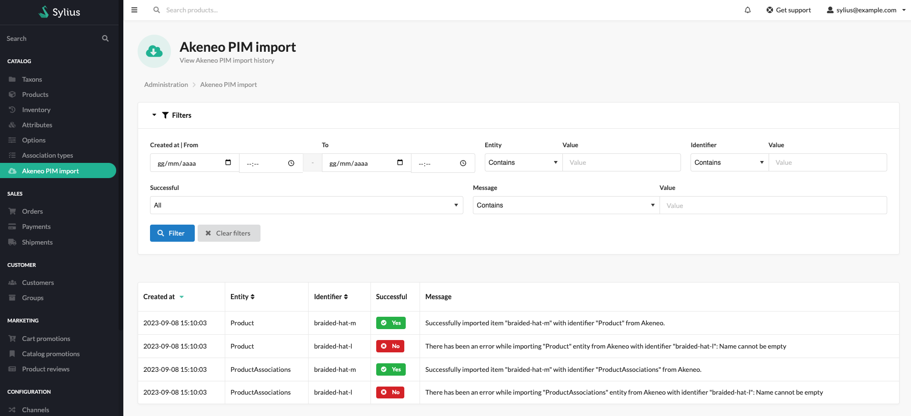


# Usage

Without any further action this plugin will not import anything from Akeneo. Depending on your import needs, after the
initial configuration you have to configure specific product **value handlers** and create some Akeneo-related entities
on Sylius.

### Importing product name, short description and description

If you want to import name, short description and description for your products you have to configure proper **
translatable property value handlers** in the `config/packages/webgriffe_sylius_akeneo_plugin.yaml` file:

```yaml
# config/packages/webgriffe_sylius_akeneo_plugin.yaml

webgriffe_sylius_akeneo:
    # ...
    value_handlers:
        product:
            # ...
            name:
                type: 'translatable_property'
                options:
                    $akeneoAttributeCode: 'name'
                    $translationPropertyPath: 'name'
            short_description:
                type: 'translatable_property'
                options:
                    $akeneoAttributeCode: 'short_description'
                    $translationPropertyPath: 'shortDescription'
            description:
                type: 'translatable_property'
                options:
                    $akeneoAttributeCode: 'description'
                    $translationPropertyPath: 'description'
```

For each `translatable_property` value handler you have to configure, in `$translationPropertyPath`, the Sylius
product (and product variant) translation property path of the property where to store the value of the Akeneo attribute
whose code is configured with `$akeneoAttributeCode`.

In the same way you can import other translatable properties values like meta keyword, meta description and other custom
translatable properties you possibly added to your store.

### Importing product dimensions

If you want to import product dimensions like height, width, depth and weight you have to configure the proper **generic
property value handlers** in the `config/packages/webgriffe_sylius_akeneo_plugin.yaml` file:

```yaml
# config/packages/webgriffe_sylius_akeneo_plugin.yaml

webgriffe_sylius_akeneo:
    # ...
    value_handlers:
        product:
            # ...
            weight:
                type: 'generic_property'
                options:
                    $akeneoAttributeCode: 'weight'
                    $propertyPath: 'weight'
            depth:
                type: 'generic_property'
                options:
                    $akeneoAttributeCode: 'depth'
                    $propertyPath: 'depth'
            width:
                type: 'generic_property'
                options:
                    $akeneoAttributeCode: 'width'
                    $propertyPath: 'width'
            height:
                type: 'generic_property'
                options:
                    $akeneoAttributeCode: 'height'
                    $propertyPath: 'height'      
```

For each `generic_property` value handler you have to configure, in `$propertyPath`, the Sylius product property path of
the property where to store the value of the Akeneo attribute whose code is configured with `$akeneoAttributeCode`.

In the same way you can import other product properties like shipping category and other custom properties you possibly
added to your store.

### Importing product slug

This plugin is able to create a sluggified version of an Akeneo attribute value, often the product name, and import it
into Sylius product slug. If the slug is already set on Sylius for a certain product it will not be changed during the
import from Akeneo.

To enable this behavior you have to configure the **immutable slug value handler** in
the `config/packages/webgriffe_sylius_akeneo_plugin.yaml` file:

```yaml
# config/packages/webgriffe_sylius_akeneo_plugin.yaml

webgriffe_sylius_akeneo:
    # ...
    value_handlers:
        product:
            # ...
            slug:
                type: 'immutable_slug'
                options:
                    $akeneoAttributeToSlugify: 'name'      
```

In the `$akeneoAttributeToSlugify` option you have to set the Akeneo attribute code that you want to sluggify and set in
the Sylius product slug.

Otherwise, If you have a slug attribute directly on Akeneo, you can import it like any other translatable property using
a **translatable property value handler**:

```yaml
# config/packages/webgriffe_sylius_akeneo_plugin.yaml
webgriffe_sylius_akeneo:
    # ...
    value_handlers:
        product:
            # ...
            slug:
                type: 'translatable_property'
                options:
                    $akeneoAttributeCode: 'slug'
                    $translationPropertyPath: 'slug'
```

### Importing product images

If you want to import product images from Akeneo you have to configure the **image value handler** in
the `config/packages/webgriffe_sylius_akeneo_plugin.yaml` file:

```yaml
# config/packages/webgriffe_sylius_akeneo_plugin.yaml

webgriffe_sylius_akeneo:
    # ...
    value_handlers:
        product:
            # ...
            main_image:
                type: 'image'
                options:
                    $akeneoAttributeCode: 'main_image'
                    $syliusImageType: 'main_image'
            secondary_image_1:
                type: 'image'
                options:
                    $akeneoAttributeCode: 'secondary_image_1'
                    $syliusImageType: 'secondary_image_1'
            secondary_image_2:
                type: 'image'
                options:
                    $akeneoAttributeCode: 'secondary_image_2'
                    $syliusImageType: 'secondary_image_2'
```

In the `$akeneoAttributeCode` option you have to set the code of the Akeneo attribute where you store product images and
in the `$syliusImageType` you have to configure the string to set on Sylius as product image type.

### Importing product attributes values

This plugin will automatically create or update Sylius product attributes values during product import. All you have to
do is to **create, on Sylius, the same product attributes that you have on Akeneo** paying attention to assign the same
code they have on Akeneo and to choose a compatible type considering the type they have on Akeneo. For example, if you
have a simple select attribute on Akeneo you should create it as a select attribute on Sylius; similarly if you have a
text attribute on Akeneo you should create it as a text attribute on Sylius.

You're not forced to create on Sylius all the attributes you have on Akeneo but only those you need to be imported to
your store.

Then to import the actual product attributes values you have to configure the **generic attribute value handler** in
the `config/packages/webgriffe_sylius_akeneo_plugin.yaml` file:

```yaml
# config/packages/webgriffe_sylius_akeneo_plugin.yaml

webgriffe_sylius_akeneo:
    # ...
    value_handlers:
        product:
            # ...
            attributes:
                type: 'generic_attribute'      
```

The `generic_attribute` value handler doesn't need any configuration; it must be configured only once, and it will
handle
all the product attributes created on Sylius.

Also, keep in mind that **this plugin will import Sylius select attributes options** from Akeneo automatically, no
configuration is needed.

#### Akeneo file attributes handling

This plugin is also able to handle Akeneo file attributes even if there is no corresponding file attribute on Sylius.

Suppose that you have a *Technical Sheet* file attribute on Akeneo (with code `technical_sheet`) and you want to make
those technical sheets downloadable from the Sylius product page in the frontend. To do so, just **create a Sylius text
attribute with the same code** of the Akeneo *Technical Sheet* attribute. Then configure a `file_attribute` for that
attribute and make sure that the `generic_attribute` value handler is configured:

```yaml
# config/packages/webgriffe_sylius_akeneo_plugin.yaml

webgriffe_sylius_akeneo:
    # ...
    value_handlers:
        product:
            # ...
            attributes:
                type: 'generic_attribute'
            technical_sheet:
                type: 'file_attribute'
                options:
                    $akeneoAttributeCode: 'technical_sheet'
                    $downloadPath: '%sylius_core.public_dir%/media/product_technical_sheets'
```

After a product import you'll have the products technical sheets downloaded in
the `%sylius_core.public_dir%/media/product_technical_sheets` directory and the path of the technical sheet file of each
product saved in the `technical_sheet` text attribute (the path will be relative to the download path). So, in your
product show template you can have the following to allow users to download technical sheets:


```twig
{# templates/SyliusShopBundle/views/Product/show.html.twig #}



    <a href="{{ asset('media/product_technical_sheet/' ~ technicalSheet.value) }}">
        Download Techincal Sheet
    </a>

```


### Importing configurable products, product options and their values

If you have product models on Akeneo this plugin will create relative configurable products along with their variants on
Sylius. To make this possible **you must create on Sylius the product options with the same code of the related Akeneo's
family variant axes attributes**. You can leave the product options empty (without values) because they will be created
during actual product import. To do so you must configure the **product options value handler** in
the `config/packages/webgriffe_sylius_akeneo_plugin.yaml`:

```yaml
# config/packages/webgriffe_sylius_akeneo_plugin.yaml

webgriffe_sylius_akeneo:
    # ...
    value_handlers:
        product:
            # ...
            product_option:
                type: 'product_option'      
```

The `product_option` value handler doesn't need any configuration; it must be configured only once, and it will handle
all the product options created on Sylius.

### Importing product prices

If you manage product prices on Akeneo you can import them on Sylius. To do so you have to configure the channel pricing
value handler in the `config/packages/webgriffe_sylius_akeneo_plugin.yaml` file:

```yaml
# config/packages/webgriffe_sylius_akeneo_plugin.yaml

webgriffe_sylius_akeneo:
    # ...
    value_handlers:
        product:
            # ...
            price:
                type: 'channel_pricing'
                options:
                    $akeneoAttribute: 'price'      
```

In the `$akeneoAttribute` option you have to set the code of the **Akeneo price attribute** where you store your
products prices. Then they will be imported into Sylius for channels whose base currency is the same as the price
currency on Akeneo.

If you also manage the original price on Akeneo, you can import it using the same channel price value handler. Add
the `$syliusPropertyPath` option to the configuration and specify which price you are importing: price (default) or
original_price.
As above use the `$akeneoAttribute` option to specify the code of the **Akeneo original price attribute** where you
store your products original prices.

```yaml
# config/packages/webgriffe_sylius_akeneo_plugin.yaml

webgriffe_sylius_akeneo:
    # ...
    value_handlers:
        product:
            # ...
            price:
                type: 'channel_pricing'
                options:
                    $akeneoAttribute: 'price'
                    $syliusPropertyPath: 'price' # Not required, it is the default
            original_price:
                type: 'channel_pricing'
                options:
                    $akeneoAttribute: 'original_price'
                    $syliusPropertyPath: 'original_price'
```

### Importing product metrical properties

**NB. This feature is only available from Akeneo PIM version 5**

If you manage product metrical attributes on Akeneo you can import them on Sylius as product properties (like weight,
length, height and depth). To do this, you have to configure the metrical properties value handler in
the `config/packages/webgriffe_sylius_akeneo_plugin.yaml` file:

```yaml
# config/packages/webgriffe_sylius_akeneo_plugin.yaml

webgriffe_sylius_akeneo:
    # ...
    value_handlers:
        product:
            # ...
            weight:
                type: 'metric_property'
                options:
                    $akeneoAttributeCode: 'weight'
                    $propertyPath: 'weight'
            height:
                type: 'metric_property'
                options:
                    $akeneoAttributeCode: 'height'
                    $propertyPath: 'height'
                    $akeneoUnitMeasurementCode: 'CENTIMETER'
```

For each `metric_property` value handler you have to configure, in `$propertyPath`, the Sylius product property path of
the property where to store the value of the Akeneo attribute whose code is configured with `$akeneoAttributeCode`. Be
sure this is a metrical attribute on Akeneo.
In the same way you can import other product metrical properties like height and other custom properties you possibly
added to your store.
In addition, you can decide in which unit of measure to import the value. To do this, enter the desired Akeneo unit of
measurement code in the attribute `$akeneoUnitMeasurementCode`. If this field is not specified, the plugin will import
the value using Akeneo's standard unit of measure.
For more information about Akeneo's units of measurement, consult
the [documentation](https://help.akeneo.com/pim/serenity/articles/manage-your-measurements.html).

### Importing product-taxons associations

This plugin **will not import Akeneo categories into Sylius taxons**, but **it will associate Sylius products to
existing taxons** based on Akeneo product-categories associations. This plugin will associate products only to those
Sylius taxons which already exist on Sylius and have the same code of their related Akeneo categories. In this way,
products taxons association import does not need any configuration and you can have all the categories you want on
Akeneo, even those you don't want on your Sylius store. Indeed, if there are products associated to Akeneo categories
which doesn't exist on Sylius, the import will succeed with no error.

So, all you have to do is to **create on Sylius those taxons that you want products associated with** when importing
from Akeneo, paying attention to **assign the same code** of the corresponding category on Akeneo.

### Importing product associations

This plugin will also import product associations. It's a zero configuration import. All you have to do is to **create
on Sylius the same association types that you have on Akeneo** paying attention to assign the same association type
code. If you have some association type on Akeneo that you don't need on your store, simply do not create it on Sylius
and product associations importer will ignore it.

### Import data

To actually import data from Akeneo PIM you have two options: import from UI in the admin section or from the CLI with
the **webgriffe:akeneo:import** command.
Import procedure assumes that [Symfony Messenger](https://symfony.com/doc/current/messenger.html) is installed and
working as required since Sylius v1.11.

#### Import from admin Akeneo PIM button

This button allows you to import a product directly from the admin index page.



#### Import from CLI

To import multiple items at the same time you can use the `webgriffe:akeneo:import` console command:

```bash
bin/console webgriffe:akeneo:import --since="2020-01-30"
```

This will import all Akeneo entities updated after the provided date.

You can also use a "since file" where to read the since date:

```bash
echo "2022-01-30" > var/storage/akeneo-sincefile.txt
bin/console webgriffe:akeneo:import --since-file="var/storage/akeneo-sincefile.txt"
```

When run with the since file, the import command will write the current date/time to the since file after the importing
process is terminated. This is useful when you put the import command in cron:

```bash
* * * * * /usr/bin/php /path/to/sylius/bin/console -e prod -q webgriffe:akeneo:import --since-file=/path/to/sylius/var/storage/akeneo-import-sincefile.txt
```

This way the import command is run repeatedly importing only products modified since the last command execution.

You can also import items only for specific importers:

```bash
bin/console webgriffe:akeneno:import --importer="Product" --importer="MyImporter" --since="2020-01-30"
```

You can also import items regardless of their last update date:

```bash
bin/console webgriffe:akeneno:import --all
```

### Browsing item import results in the admin

You can examine the Akeneo import results from the admin panel at **Catalog -> Akeneo PIM import**. You can filter and sort items and see their error message:



### Item import results cleanup

Sometimes it may be a good idea to clean old item import results.
You can clean the item import results older than N days by launching the following command:

```bash
bin/console webgriffe:akeneo:cleanup-item-import-results {days}
```

If you do not specify a number of days, the default value of 30 days will be used.

### Products reconciliation

Product reconciliation can be useful when one or more products are deleted on Akeneo. By default, reconciliation does
not delete products on Sylius but places them in a deactivated state.
This is because the Sylius structure does not allow you to delete products if they are associated with any order.
To reconcile the products you can use the webgriffe:akeneo:reconcile console command:

```bash
bin/console webgriffe:akeneo:reconcile
```

It could be useful to add also this command to your scheduler to run automatically every day or whatever you want.

### Suggested crontab

To make all importers and other plugin features work automatically the following is the suggested crontab:

```
0   *   *  *  *  /path/to/sylius/bin/console -e prod -q webgriffe:akeneo:import --all --importer="AttributeOptions"
*   *   *  *  *  /path/to/sylius/bin/console -e prod -q webgriffe:akeneo:import --since-file=/path/to/sylius/var/storage/akeneo-import-sincefile.txt --importer="Product" --importer="ProductModel" --importer="ProductAssociations"
0   */6 *  *  *  /path/to/sylius/bin/console -e prod -q webgriffe:akeneo:reconcile
0   0   *  *  *  /path/to/sylius/bin/console -e prod -q webgriffe:akeneo:cleanup-item-import-results
```

This will:

* Import the update of all attribute options every hour
* Import, every minute, all products and product models that have been modified since the last execution, along with their associations
* Reconcile Akeneo deleted products every 6 hours

> *NB*: The line that imports products, product models and product associations every minute should be added only if you do not use the
> webhook feature (see next chapter). Otherwise, the products will be imported twice.

Import and Reconcile commands uses a [lock mechanism](https://symfony.com/doc/current/console/lockable_trait.html) which
prevents running them if another instance of the same command is already running.

